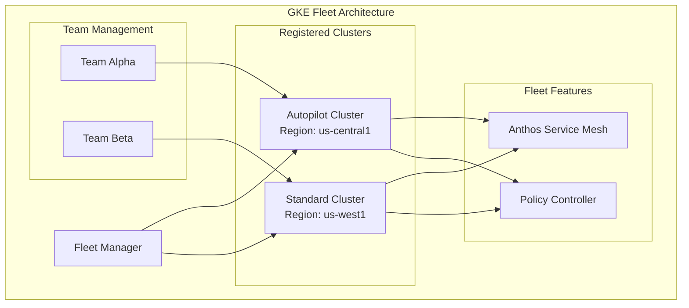

# Design Document: GKE Fleets Enterprise Platform

## Overview

This design document outlines the architecture and implementation approach for enterprise-grade README.md documentation covering GKE Fleet management at scale. The documentation follows the GEMINI.MD style guide for Staff Platform Architect-level technical writing, focusing on multi-cluster Kubernetes governance, team-based access control, and fleet-wide feature enablement.

## Target Audience

Platform engineers, DevOps practitioners, and cloud architects managing multi-cluster Kubernetes environments at enterprise scale using Google Kubernetes Engine (GKE).

## Architecture

## Core Components

### 1. GKE Fleet
- Central management plane for multi-cluster operations
- Unified identity and access management
- Fleet-level feature orchestration

### 2. Cluster Types
- **Autopilot Clusters**: Fully managed node provisioning
- **Standard Clusters**: User-managed node pools with granular control

### 3. Fleet Features
- **Anthos Service Mesh**: Service-to-service communication, observability, security
- **Policy Controller**: Kubernetes admission control using Gatekeeper

### 4. Team-Based Management
- Namespace isolation per team
- Role-based access control (RBAC)
- Dedicated service accounts and workloads

## Documentation Structure

The README.md will follow this structure:

1. **Header Section**: Title, badges, one-line value proposition
2. **Architecture Diagram**: Visual representation of fleet topology
3. **Prerequisites**: Environment setup, API enablement
4. **Step-by-Step Implementation**:
   - Fleet creation
   - Cluster provisioning (Autopilot and Standard)
   - Cluster registration
   - Feature enablement (Service Mesh, Policy Controller)
   - Team setup and RBAC configuration
   - Application deployment
   - Observability and logging
5. **Verification & Validation**: Screenshots, terminal outputs
6. **Cleanup**: Resource deletion instructions

## Correctness Properties

**Preconditions:**
- Google Cloud project with required APIs enabled
- Sufficient IAM permissions (GKE Admin, Fleet Admin)
- Network resources (VPC, subnets) pre-configured

**Postconditions:**
- Fleet created and operational
- Clusters registered with healthy status
- Service Mesh and Policy Controller enabled fleet-wide
- Teams configured with appropriate RBAC bindings
- Applications deployed and accessible

## Image Requirements

| Image Name                           | Purpose                      | Position                   |
| ------------------------------------ | ---------------------------- | -------------------------- |
| `fleet-architecture-topology.png`    | High-level fleet overview    | Above architecture section |
| `gke-fleet-console-view.png`         | Fleet dashboard verification | Below fleet creation step  |
| `cluster-registration-status.png`    | Cluster health status        | Below registration step    |
| `service-mesh-enablement.png`        | Mesh feature activation      | Below mesh setup           |
| `policy-controller-dashboard.png`    | Policy violations view       | Below policy setup         |
| `team-rbac-configuration.png`        | Team namespace isolation     | Below team setup           |
| `application-deployment-success.png` | Deployed workload status     | Below deployment step      |
| `fleet-logs-overview.png`            | Centralized logging view     | Below logging section      |

## Implementation Notes

- Use environment variables (`$PROJECT_ID`, `$REGION`, `$ZONE`) throughout
- Prefer declarative Kubernetes manifests over imperative CLI commands
- Include timing warnings for long-running operations
- Provide both CLI and Console verification paths
