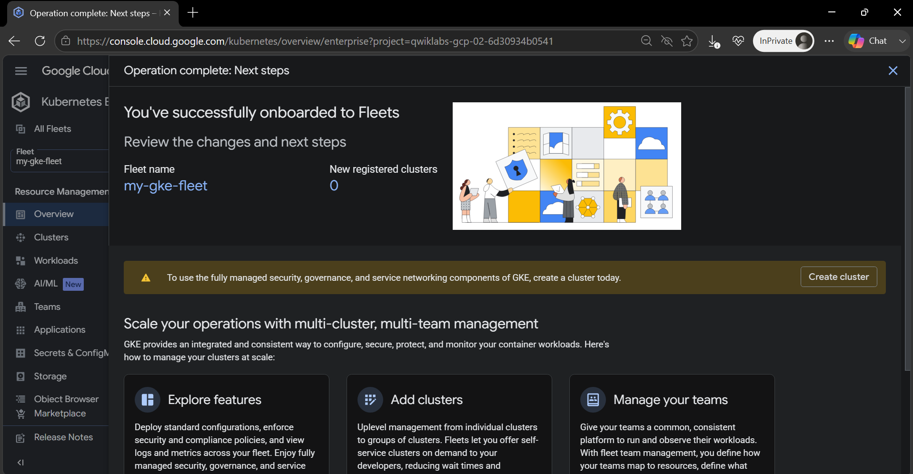
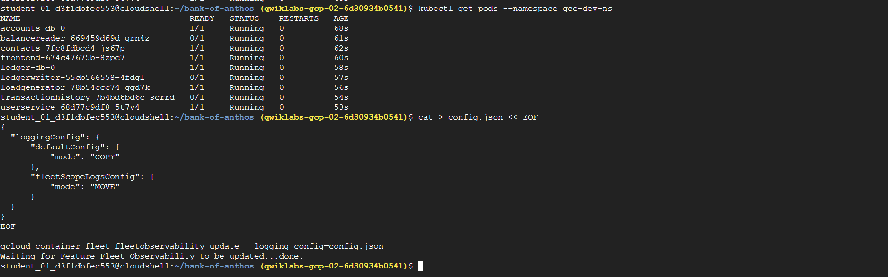
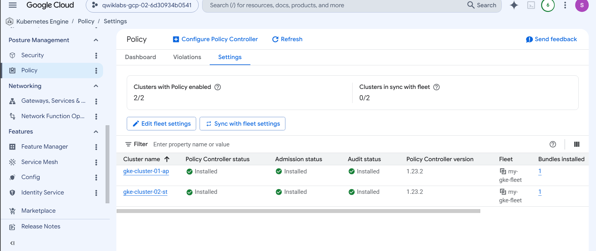
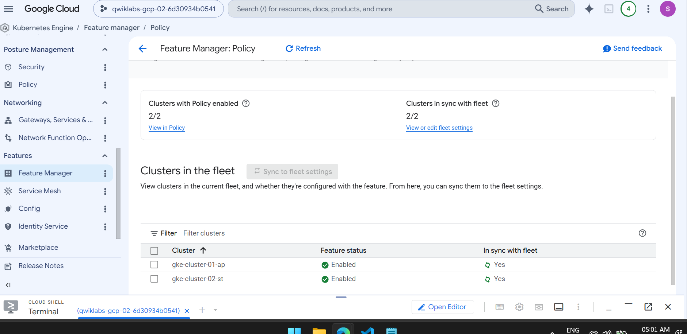
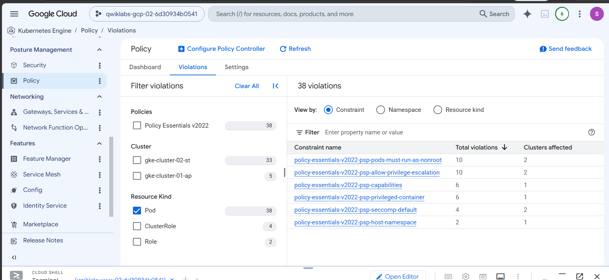
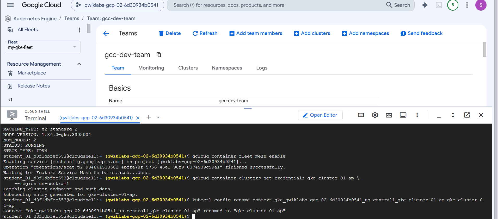
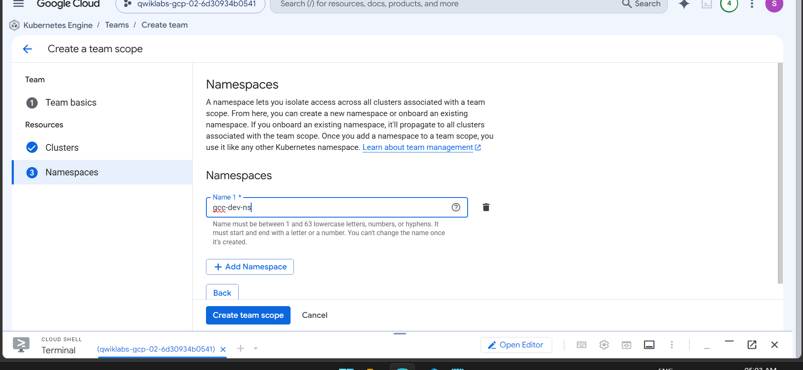
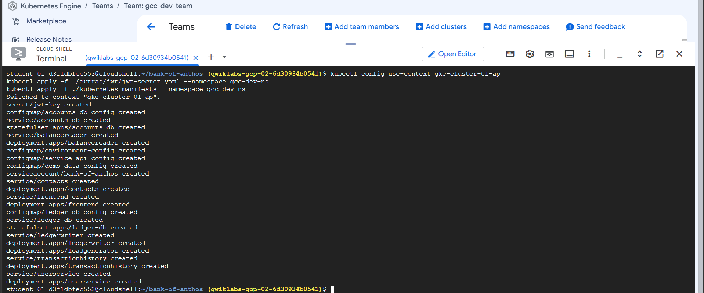
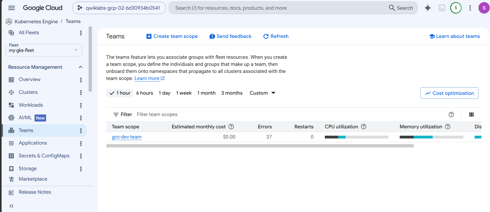

<div align="center">


#  FleetOpsGKE

### Manage Workloads at Scale with GKE Fleets and Teams
 &nbsp;
&nbsp;
 &nbsp;
 &nbsp;
</div>

## Executive Summary

A production-grade implementation playbook for orchestrating multi-cluster GKE environments at scale using GKE Fleets and Teams. This walkthrough guides you through establishing unified cluster management, enabling centralized policies, and enforcing secure team boundaries.

---

## Architecture Overview

<p align="center">
  
</p>

The GKE Fleets Enterprise Platform architecture integrates a centralized management hub (the Fleet) with heterogeneous cluster resources, service mesh governance, and isolation boundaries. It allows platform administrators to manage GKE clusters as a single entity while maintaining strict workspace separation for product development teams.

---

## Business Problem

As enterprises scale their Kubernetes footprint, managing clusters as isolated silos leads to configuration drift, inconsistent security postures, complex service-to-service communication paths, and decentralized user access. Operating clusters individually increases administrative overhead and raises security vulnerabilities due to non-standardized policy implementation.

---

## Solution Overview

This lab solves these challenges by establishing a GKE Fleet to unify multi-cluster Kubernetes operations. Through the Fleet model, you enable Anthos Service Mesh for transparent mutual TLS (mTLS) traffic encryption and Policy Controller for fleet-wide policy compliance. Finally, you map physical clusters to logical Teams, creating isolated namespaces, local Service Accounts, and RBAC bindings to enforce namespace-level multi-tenancy.

---

## Reference Architecture

The architecture relies on the following key Google Cloud and GKE services, configured to work in unison to provide a cohesive management and runtime plane.

☸️ GKE Fleets

GKE Fleets is Google Cloud's centralized management framework for multi-cluster operations.

It groups clusters logically to simplify management and enable unified feature deployment while allowing teams to focus on application deployment rather than maintaining individual cluster configurations.

### Enterprise Use Cases
• Centralized governance and compliance across multi-region environments
• Unified multi-cluster ingress and traffic routing
• Fleet-level service mesh enablement

---

☸️ GKE Autopilot

GKE Autopilot is a fully managed, Google-operated mode of Google Kubernetes Engine.

It automates node provisioning, scaling, patching, and security configuration based on pod resource requests while allowing teams to focus on building applications rather than managing VM nodes and operating system security.

### Enterprise Use Cases
• Serverless Kubernetes deployments with resource-based billing
• Out-of-the-box cluster hardening matching Google's security best practices
• Fast application scaling without node-pool configuration overhead

---

☸️ GKE Standard

GKE Standard is a user-managed mode of Google Kubernetes Engine.

It provides granular control over node pools, VM types, and OS versions while allowing teams to fine-tune infrastructure for specialized workloads.

### Enterprise Use Cases
• Workloads requiring custom kernel modifications, GPUs, or local SSD storage
• Fine-grained scheduling control using custom node pools and taints
• Strict networking or compliance requirements that demand specific host configurations

---

☸️ Anthos Service Mesh (ASM)

Anthos Service Mesh is Google Cloud's fully managed service mesh built on Istio.

It enables secure, observable, and resilient communication between services while allowing teams to leverage zero-trust network principles without writing transport-level encryption or routing code.

### Enterprise Use Cases
• Enforcing mutual TLS (mTLS) across all service-to-service communication paths
• Implementing fine-grained traffic splitting and canary deployments
• Obtaining aggregated service telemetry, metrics, and distributed tracing data

---

☸️ Policy Controller

Policy Controller is Google Cloud's declarative policy engine built on the open-source OPA Gatekeeper project.

It audits and enforces Kubernetes resource configurations against organizational compliance rules while allowing teams to deploy resources without violating company guardrails.

### Enterprise Use Cases
• Preventing the deployment of unsecure configurations (e.g., privileged containers)
• Auditing resources in real-time to check for non-compliant parameters
• Restricting namespaces or service labels to enforce operational structure

---

## Prerequisites

To complete this lab, ensure you have access to a Google Cloud project with the necessary administrative permissions.

### Required IAM Roles
Ensure your identity is bound to the following IAM roles in the target Google Cloud project:
- **Kubernetes Engine Admin** (`roles/container.admin`) - Full control over GKE resources and cluster operations.
- **GKE Hub Admin** (`roles/gkehub.admin`) - Authorization to register clusters to GKE Fleets.
- **Service Account Admin** (`roles/iam.serviceAccountAdmin`) - Permissions to manage service accounts for team isolation.
- **Anthos Service Mesh Admin** (`roles/anthos.serviceMeshAdmin`) - Management rights for enabling ASM features.
- **Policy Admin** (`roles/anthosconfigmanagement.policyAdmin`) - Governance configuration capabilities for Policy Controller.

### API Enablement
Enable the required Google Cloud APIs for GKE Fleet and cluster operations:

```bash
gcloud services enable \
    --project=$PROJECT_ID \
    container.googleapis.com \
    gkehub.googleapis.com \
    gkeconnect.googleapis.com \
    mesh.googleapis.com \
    meshconfig.googleapis.com \
    meshca.googleapis.com \
    anthosconfigmanagement.googleapis.com \
    cloudresourcemanager.googleapis.com \
    iamcredentials.googleapis.com \
    logging.googleapis.com \
    monitoring.googleapis.com
```

> [!NOTE]
> API enablement typically takes 2-3 minutes to propagate across Google's global infrastructure. You can verify enablement status with `gcloud services list --enabled --project=$PROJECT_ID`.

---

## Repository Structure

The repository is structured logically to separate platform instructions from configuration files and assets:

- 📁 **`kubernetes-manifests/`** - Kubernetes resource definitions for multi-cluster banking services:
  - [`accounts-db.yaml`](file:///d:/abhi/fleets/kubernetes-manifests/accounts-db.yaml) - Database service and state configuration for bank accounts.
  - [`balance-reader.yaml`](file:///d:/abhi/fleets/kubernetes-manifests/balance-reader.yaml) - Balance reader deployment and service.
  - [`config.yaml`](file:///d:/abhi/fleets/kubernetes-manifests/config.yaml) - ConfigMap and global parameters.
  - [`contacts.yaml`](file:///d:/abhi/fleets/kubernetes-manifests/contacts.yaml) - Service contacts application deployment.
  - [`frontend.yaml`](file:///d:/abhi/fleets/kubernetes-manifests/frontend.yaml) - User interface frontend deployment.
  - [`ledger-db.yaml`](file:///d:/abhi/fleets/kubernetes-manifests/ledger-db.yaml) - Financial ledger database components.
  - [`ledger-writer.yaml`](file:///d:/abhi/fleets/kubernetes-manifests/ledger-writer.yaml) - Transaction log ledger writer deployment.
  - [`loadgenerator.yaml`](file:///d:/abhi/fleets/kubernetes-manifests/loadgenerator.yaml) - Synthetic load generation tool.
  - [`transaction-history.yaml`](file:///d:/abhi/fleets/kubernetes-manifests/transaction-history.yaml) - Transaction query backend service.
  - [`userservice.yaml`](file:///d:/abhi/fleets/kubernetes-manifests/userservice.yaml) - Core user authentication and profile database.
- 📁 **`images/`** - Local folder containing architectural diagrams and CLI command verification screenshots.
- 📄 **`README.md`** - Main playbook documenting enterprise deployment and setup steps.
- 📄 **`Agent.md`** - Documentation guidelines and assistant prompt logic.

---

## Environment Variables

Define the following environment variables in your terminal session before running any commands to prevent hardcoding:

```bash
# Core project configuration
export PROJECT_ID="your-project-id"
export REGION="us-central1"
export ZONE="us-central1-a"

# Fleet configuration
export FLEET_NAME="enterprise-fleet"

# Cluster names
export AUTOPILOT_CLUSTER="autopilot-prod"
export STANDARD_CLUSTER="standard-prod"

# Team namespaces
export TEAM_ALPHA_NS="team-alpha"
export TEAM_BETA_NS="team-beta"
```

---

## Implementation

Follow these steps sequentially to provision the infrastructure and configure the multi-cluster environment.

### Step 1: Create the GKE Fleet

Initialize a fleet to serve as the centralized management plane for all registered clusters.

```bash
gcloud container fleet create $FLEET_NAME \
    --project=$PROJECT_ID \
    --location=$REGION
```

Verify fleet creation:

```bash
gcloud container fleet describe \
    --project=$PROJECT_ID \
    --location=$REGION
```

**Expected Output:**

```yaml
name: projects/your-project-id/locations/us-central1/fleets/enterprise-fleet
createTime: '2024-01-15T10:30:00.000000000Z'
state:
  code: OK
```

<p align="center">
  
</p>

> [!WARNING]
> Fleet creation is a regional operation. Once a fleet is created, it cannot be moved to a different region without deletion and recreation. Ensure your region selection aligns with your compliance and latency requirements.

---

### Step 2: Provision GKE Clusters

#### 2.1 Create Autopilot Cluster

Provision an Autopilot cluster with fully managed node provisioning:

```bash
gcloud container clusters create-auto $AUTOPILOT_CLUSTER \
    --project=$PROJECT_ID \
    --region=$REGION \
    --release-channel=regular
```

> [!NOTE]
> Autopilot clusters eliminate node management overhead. Google Cloud automatically provisions nodes based on pod resource requests, applies security patches, and handles cluster scaling. This model shifts billing from node instances to pod resource consumption.

#### 2.2 Create Standard Cluster

Provision a Standard cluster with user-managed node pools:

```bash
gcloud container clusters create $STANDARD_CLUSTER \
    --project=$PROJECT_ID \
    --zone=$ZONE \
    --num-nodes=3 \
    --machine-type=e2-standard-4 \
    --release-channel=regular \
    --enable-ip-alias \
    --enable-autoscaling \
    --min-nodes=1 \
    --max-nodes=5
```

> [!TIP]
> Standard clusters provide granular control over node configuration, making them suitable for workloads with specific OS, GPU, or local SSD requirements.

---

### Step 3: Register Clusters to the Fleet

Register both clusters to the fleet for unified management.

#### 3.1 Register Autopilot Cluster

```bash
gcloud container fleet memberships register ${AUTOPILOT_CLUSTER}-membership \
    --project=$PROJECT_ID \
    --gke-cluster=${REGION}/${AUTOPILOT_CLUSTER} \
    --enable-workload-identity
```

#### 3.2 Register Standard Cluster

```bash
gcloud container fleet memberships register ${STANDARD_CLUSTER}-membership \
    --project=$PROJECT_ID \
    --gke-cluster=${ZONE}/${STANDARD_CLUSTER} \
    --enable-workload-identity
```

Verify cluster registration:

```bash
gcloud container fleet memberships list \
    --project=$PROJECT_ID
```

**Expected Output:**

```
NAME                        LOCATION        CLUSTER
autopilot-prod-membership   us-central1     autopilot-prod
standard-prod-membership    us-central1-a   standard-prod
```

<p align="center">
  
</p>

> [!WARNING]
> Cluster registration requires the GKE Connect Agent to be deployed. This process can take 5-10 minutes. Do not interrupt the registration process or attempt to re-register until the operation completes.

---

### Step 4: Enable Fleet Features

#### 4.1 Enable Anthos Service Mesh

Enable Service Mesh for fleet-wide service-to-service communication:

```bash
gcloud container fleet mesh enable \
    --project=$PROJECT_ID

gcloud container fleet mesh update \
    --project=$PROJECT_ID \
    --management automatic \
    --memberships ${AUTOPILOT_CLUSTER}-membership,${STANDARD_CLUSTER}-membership
```

Verify Service Mesh status:

```bash
gcloud container fleet mesh describe \
    --project=$PROJECT_ID
```

<p align="center">
  
</p>

> [!NOTE]
> Anthos Service Mesh provides automatic mTLS encryption, traffic management, and distributed tracing. When managed automatically, Google handles control plane upgrades and security patches.

#### 4.2 Enable Policy Controller

Enable Policy Controller for Kubernetes admission control:

```bash
gcloud container fleet policycontroller enable \
    --project=$PROJECT_ID

gcloud container fleet policycontroller membership set ${AUTOPILOT_CLUSTER}-membership \
    --project=$PROJECT_ID \
    --policy-dir=policies \
    --source=git \
    --branch=main

gcloud container fleet policycontroller membership set ${STANDARD_CLUSTER}-membership \
    --project=$PROJECT_ID \
    --policy-dir=policies \
    --source=git \
    --branch=main
```

<p align="center">
  
</p>

<p align="center">
  
</p>

<p align="center">
  
</p>

> [!CAUTION]
> Policy Controller enforces constraints that can block deployments. Always test constraint templates in a non-production environment before fleet-wide enforcement. Review existing workloads for compliance before enabling strict modes.

---

### Step 5: Configure Teams for Fleet Management

#### 5.1 Create Team Namespaces

Create dedicated namespaces for team isolation:

```yaml
# team-namespaces.yaml
apiVersion: v1
kind: Namespace
metadata:
  name: team-alpha
  labels:
    team: alpha
    fleet-member: autopilot-prod
---
apiVersion: v1
kind: Namespace
metadata:
  name: team-beta
  labels:
    team: beta
    fleet-member: standard-prod
```

Apply the namespace configuration:

```bash
kubectl apply -f team-namespaces.yaml
```

#### 5.2 Create Team Service Accounts

```yaml
# team-service-accounts.yaml
apiVersion: v1
kind: ServiceAccount
metadata:
  name: team-alpha-sa
  namespace: team-alpha
---
apiVersion: v1
kind: ServiceAccount
metadata:
  name: team-beta-sa
  namespace: team-beta
```

```bash
kubectl apply -f team-service-accounts.yaml
```

#### 5.3 Configure RBAC Bindings

```yaml
# team-rbac.yaml
apiVersion: rbac.authorization.k8s.io/v1
kind: Role
metadata:
  name: team-alpha-developer
  namespace: team-alpha
rules:
- apiGroups: [""]
  resources: ["pods", "services", "configmaps", "secrets"]
  verbs: ["get", "list", "watch", "create", "update", "patch", "delete"]
- apiGroups: ["apps"]
  resources: ["deployments", "replicasets"]
  verbs: ["get", "list", "watch", "create", "update", "patch", "delete"]
---
apiVersion: rbac.authorization.k8s.io/v1
kind: RoleBinding
metadata:
  name: team-alpha-developer-binding
  namespace: team-alpha
subjects:
- kind: User
  name: team-alpha-user@example.com
  apiGroup: rbac.authorization.k8s.io
roleRef:
  kind: Role
  name: team-alpha-developer
  apiGroup: rbac.authorization.k8s.io
---
apiVersion: rbac.authorization.k8s.io/v1
kind: Role
metadata:
  name: team-beta-developer
  namespace: team-beta
rules:
- apiGroups: [""]
  resources: ["pods", "services", "configmaps", "secrets"]
  verbs: ["get", "list", "watch", "create", "update", "patch", "delete"]
- apiGroups: ["apps"]
  resources: ["deployments", "replicasets"]
  verbs: ["get", "list", "watch", "create", "update", "patch", "delete"]
---
apiVersion: rbac.authorization.k8s.io/v1
kind: RoleBinding
metadata:
  name: team-beta-developer-binding
  namespace: team-beta
subjects:
- kind: User
  name: team-beta-user@example.com
  apiGroup: rbac.authorization.k8s.io
roleRef:
  kind: Role
  name: team-beta-developer
  apiGroup: rbac.authorization.k8s.io
```

```bash
kubectl apply -f team-rbac.yaml
```

<p align="center">
  
</p>

<p align="center">
  
</p>

> [!TIP]
> Use Kubernetes RoleBindings for namespace-level access and ClusterRoleBindings for cluster-wide operations. For fleet-level access control, consider using Anthos RBAC with Fleet-level roles.

---

### Step 6: Deploy Applications to Teams

#### 6.1 Deploy Sample Application to Team Alpha

```yaml
# team-alpha-app.yaml
apiVersion: apps/v1
kind: Deployment
metadata:
  name: sample-app
  namespace: team-alpha
spec:
  replicas: 3
  selector:
    matchLabels:
      app: sample-app
      team: alpha
  template:
    metadata:
      labels:
        app: sample-app
        team: alpha
    spec:
      serviceAccountName: team-alpha-sa
      containers:
      - name: nginx
        image: nginx:1.25
        ports:
        - containerPort: 80
        resources:
          requests:
            cpu: 100m
            memory: 128Mi
          limits:
            cpu: 500m
            memory: 256Mi
---
apiVersion: v1
kind: Service
metadata:
  name: sample-app-svc
  namespace: team-alpha
spec:
  selector:
    app: sample-app
  ports:
  - port: 80
    targetPort: 80
  type: ClusterIP
```

```bash
kubectl apply -f team-alpha-app.yaml
```

#### 6.2 Deploy Sample Application to Team Beta

```yaml
# team-beta-app.yaml
apiVersion: apps/v1
kind: Deployment
metadata:
  name: sample-app
  namespace: team-beta
spec:
  replicas: 2
  selector:
    matchLabels:
      app: sample-app
      team: beta
  template:
    metadata:
      labels:
        app: sample-app
        team: beta
    spec:
      serviceAccountName: team-beta-sa
      containers:
      - name: nginx
        image: nginx:1.25
        ports:
        - containerPort: 80
        resources:
          requests:
            cpu: 100m
            memory: 128Mi
          limits:
            cpu: 500m
            memory: 256Mi
---
apiVersion: v1
kind: Service
metadata:
  name: sample-app-svc
  namespace: team-beta
spec:
  selector:
    app: sample-app
  ports:
  - port: 80
    targetPort: 80
  type: ClusterIP
```

```bash
kubectl apply -f team-beta-app.yaml
```

Verify deployment status:

```bash
# Verify Team Alpha deployment
kubectl get deployments -n team-alpha
kubectl get pods -n team-alpha

# Verify Team Beta deployment
kubectl get deployments -n team-beta
kubectl get pods -n team-beta
```

<p align="center">
  
</p>

---

## Validation

Use the checklist below to verify the successful configuration and deployment state of all fleet infrastructure.

| Step | Verification Command | Expected State |
| :--- | :--- | :--- |
| **Fleet Creation** | `gcloud container fleet describe --project=$PROJECT_ID` | `state.code: OK` |
| **Cluster Registration** | `gcloud container fleet memberships list --project=$PROJECT_ID` | Both memberships listed |
| **Service Mesh** | `gcloud container fleet mesh describe --project=$PROJECT_ID` | `state.code: OK` |
| **Policy Controller** | `gcloud container fleet policycontroller describe --project=$PROJECT_ID` | `state.code: OK` |
| **Team Namespaces** | `kubectl get namespaces -l team` | `team-alpha`, `team-beta` |
| **Application Health** | `kubectl get pods -A -l app=sample-app` | All pods `Running` |

---

## Observability

### Fleet-Level Observability
Access the GKE Fleet console to view aggregated cluster health and telemetry metrics:

```bash
# Open the GKE Fleet console
echo "https://console.cloud.google.com/kubernetes/fleet?project=$PROJECT_ID"
```

### Team-Based Log Queries
Query logs for specific team namespaces using Cloud Logging to verify isolated logging functionality:

```bash
# Team Alpha logs
gcloud logging read 'resource.type="k8s_container" AND resource.labels.namespace_name="team-alpha"' \
    --project=$PROJECT_ID \
    --limit=50

# Team Beta logs
gcloud logging read 'resource.type="k8s_container" AND resource.labels.namespace_name="team-beta"' \
    --project=$PROJECT_ID \
    --limit=50
```

<p align="center">
  
</p>

> [!NOTE]
> Cloud Logging automatically aggregates logs from all registered clusters. You can create log-based metrics and alerts for fleet-wide monitoring without additional instrumentation.

### Fleet Feature Status Dashboard

Run the following descriptors to pull feature states directly from the Fleet APIs:

```bash
# View overall fleet feature status
gcloud container fleet describe \
    --project=$PROJECT_ID \
    --location=$REGION

# View membership details
gcloud container fleet memberships describe ${AUTOPILOT_CLUSTER}-membership \
    --project=$PROJECT_ID

# View mesh status
gcloud container fleet mesh describe \
    --project=$PROJECT_ID
```

---

## Troubleshooting

### 1. Policy Controller Sync Errors
* **Issue**: Policies fail to sync from Git repository.
* **Resolution**: Validate the Git configuration using `gcloud container fleet policycontroller describe --project=$PROJECT_ID`. Ensure that the Git credentials and repository path are accessible, and that the directory structure matches the expected `policy-dir` structure (e.g., standard Git source layout).

### 2. Service Mesh Installation Latency
* **Issue**: Anthos Service Mesh status remains stuck in `PROVISIONING` or `FAILED`.
* **Resolution**: Verify that the cluster meets the GKE version and release channel prerequisites. You can inspect cluster-specific registration status details using:
  ```bash
  gcloud container fleet mesh describe --project=$PROJECT_ID
  ```

### 3. Workload Identity Integration Issues
* **Issue**: Pods fail to authenticate to Google Cloud APIs using Workload Identity.
* **Resolution**: Verify that Workload Identity is successfully enabled on the cluster and the registered membership:
  ```bash
  gcloud container fleet memberships describe ${AUTOPILOT_CLUSTER}-membership --project=$PROJECT_ID
  ```
  Ensure your Kubernetes Service Accounts have the proper annotation mapping them to their corresponding IAM Service Account.

---

## Cleanup

> [!CAUTION]
> The following teardown commands will permanently destroy GKE clusters, the central Fleet, namespaces, and all running application workloads. Confirm you have backed up any critical work before running them.

```bash
# Delete applications
kubectl delete -f team-alpha-app.yaml
kubectl delete -f team-beta-app.yaml

# Delete RBAC configurations
kubectl delete -f team-rbac.yaml
kubectl delete -f team-service-accounts.yaml
kubectl delete -f team-namespaces.yaml

# Disable fleet features
gcloud container fleet policycontroller disable --project=$PROJECT_ID
gcloud container fleet mesh disable --project=$PROJECT_ID

# Unregister clusters
gcloud container fleet memberships unregister ${AUTOPILOT_CLUSTER}-membership \
    --project=$PROJECT_ID
gcloud container fleet memberships unregister ${STANDARD_CLUSTER}-membership \
    --project=$PROJECT_ID

# Delete GKE clusters
gcloud container clusters delete $AUTOPILOT_CLUSTER \
    --project=$PROJECT_ID \
    --region=$REGION \
    --quiet
gcloud container clusters delete $STANDARD_CLUSTER \
    --project=$PROJECT_ID \
    --zone=$ZONE \
    --quiet

# Delete fleet
gcloud container fleet delete $FLEET_NAME \
    --project=$PROJECT_ID \
    --location=$REGION \
    --quiet
```
