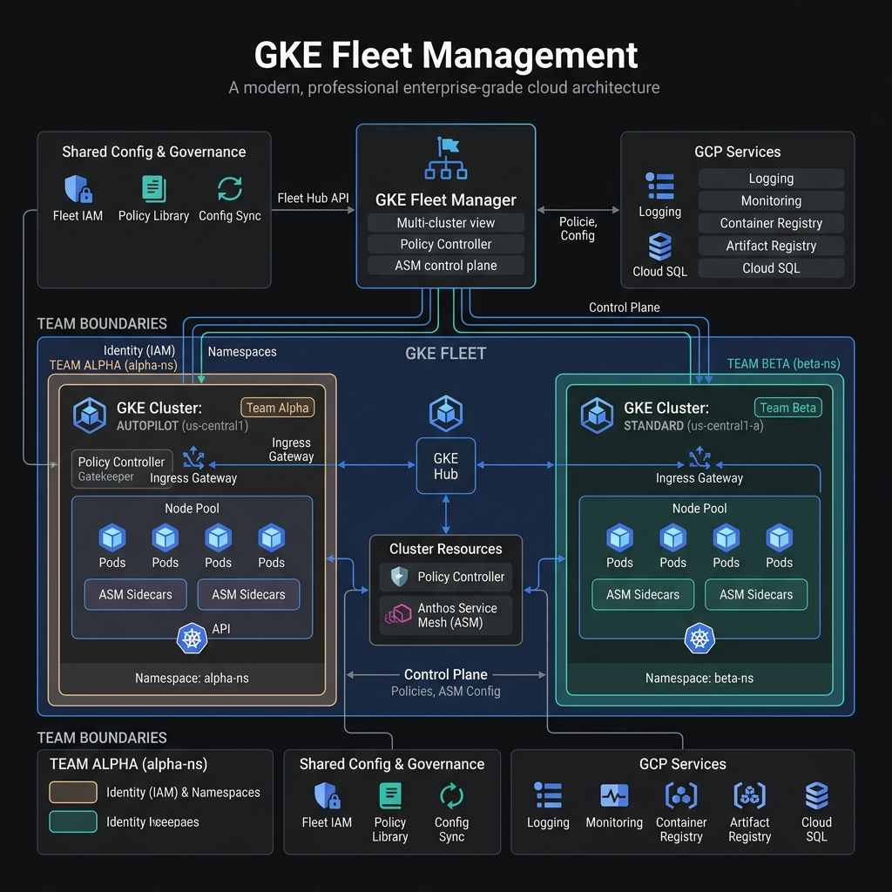

<div align="center">


# GKE Fleets Enterprise Platform

### Manage Workloads at Scale with GKE Fleets and Teams

[](https://cloud.google.com)
[](https://kubernetes.io)
[](https://cloud.google.com/kubernetes-engine)

</div>

---

## Overview

This lab demonstrates how to orchestrate multi-cluster Kubernetes environments at enterprise scale using **GKE Fleets** and **Teams**. You will provision a centralized fleet management plane, register both Autopilot and Standard GKE clusters, enable fleet-level features such as Anthos Service Mesh and Policy Controller, and implement team-based access control with dedicated namespaces and RBAC bindings.

By completing this walkthrough, you will establish a production-grade multi-cluster architecture that enables:

- **Unified Cluster Management**: Single control plane for all Kubernetes clusters
- **Fleet-Wide Feature Enablement**: Consistent service mesh and policy governance
- **Team-Based Isolation**: Namespace-level multi-tenancy with RBAC
- **Centralized Observability**: Aggregated logs and metrics across clusters

---

## Architecture

<p align="center">
  
</p>

The architecture comprises a **GKE Fleet** serving as the central management plane, with registered Autopilot and Standard clusters spanning multiple regions. Fleet features like **Anthos Service Mesh** and **Policy Controller** are enabled cluster-wide, while teams operate within isolated namespaces with dedicated RBAC bindings.

### Core Components

| Component               | Purpose                                                      |
| ----------------------- | ------------------------------------------------------------ |
| **GKE Fleet**           | Central management plane for multi-cluster operations        |
| **Autopilot Cluster**   | Fully managed node provisioning with per-pod billing         |
| **Standard Cluster**    | User-managed node pools with granular infrastructure control |
| **Anthos Service Mesh** | Service-to-service communication, mTLS, and observability    |
| **Policy Controller**   | Kubernetes admission control using Gatekeeper constraints    |
| **Teams**               | Namespace isolation with RBAC for multi-tenancy              |

---

## Prerequisites

### Environment Variables

Define the following environment variables before executing any commands:

```bash
# Core project configuration
export PROJECT_ID="your-project-id"
export REGION="us-central1"
export ZONE="us-central1-a"

# Fleet configuration
export FLEET_NAME="enterprise-fleet"

# Cluster names
export AUTOPILOT_CLUSTER="autopilot-prod"
export STANDARD_CLUSTER="standard-prod"

# Team namespaces
export TEAM_ALPHA_NS="team-alpha"
export TEAM_BETA_NS="team-beta"
```

### Required IAM Permissions

> [!NOTE]
> You must have the following IAM roles to complete this lab:
> - `roles/container.admin` - GKE Admin
> - `roles/gkehub.admin` - Fleet Admin
> - `roles/iam.serviceAccountAdmin` - Service Account Management
> - `roles/anthos.serviceMeshAdmin` - Service Mesh Management
> - `roles/anthosconfigmanagement.policyAdmin` - Policy Controller Administration

### API Enablement

Enable the required Google Cloud APIs for GKE Fleet operations:

```bash
gcloud services enable \
    --project=$PROJECT_ID \
    container.googleapis.com \
    gkehub.googleapis.com \
    gkeconnect.googleapis.com \
    mesh.googleapis.com \
    meshconfig.googleapis.com \
    meshca.googleapis.com \
    anthosconfigmanagement.googleapis.com \
    cloudresourcemanager.googleapis.com \
    iamcredentials.googleapis.com \
    logging.googleapis.com \
    monitoring.googleapis.com
```

> [!TIP]
> API enablement typically takes 2-3 minutes to propagate across Google's global infrastructure. You can verify enablement status with `gcloud services list --enabled --project=$PROJECT_ID`.

---

## Implementation

### Step 1: Create the GKE Fleet

Initialize a fleet to serve as the centralized management plane for all registered clusters.

```bash
gcloud container fleet create $FLEET_NAME \
    --project=$PROJECT_ID \
    --location=$REGION
```

<p align="center">
  
</p>

> [!WARNING]
> Fleet creation is a regional operation. Once a fleet is created, it cannot be moved to a different region without deletion and recreation. Ensure your region selection aligns with your compliance and latency requirements.

Verify fleet creation:

```bash
gcloud container fleet describe \
    --project=$PROJECT_ID \
    --location=$REGION
```

**Expected Output:**

```yaml
name: projects/your-project-id/locations/us-central1/fleets/enterprise-fleet
createTime: '2024-01-15T10:30:00.000000000Z'
state:
  code: OK
```

---

### Step 2: Provision GKE Clusters

#### 2.1 Create Autopilot Cluster

Provision an Autopilot cluster with fully managed node provisioning:

```bash
gcloud container clusters create-auto $AUTOPILOT_CLUSTER \
    --project=$PROJECT_ID \
    --region=$REGION \
    --release-channel=regular
```

> [!NOTE]
> Autopilot clusters eliminate node management overhead. Google Cloud automatically provisions nodes based on pod resource requests, applies security patches, and handles cluster scaling. This model shifts billing from node instances to pod resource consumption.

#### 2.2 Create Standard Cluster

Provision a Standard cluster with user-managed node pools:

```bash
gcloud container clusters create $STANDARD_CLUSTER \
    --project=$PROJECT_ID \
    --zone=$ZONE \
    --num-nodes=3 \
    --machine-type=e2-standard-4 \
    --release-channel=regular \
    --enable-ip-alias \
    --enable-autoscaling \
    --min-nodes=1 \
    --max-nodes=5
```

> [!TIP]
> Standard clusters provide granular control over node configuration, making them suitable for workloads with specific OS, GPU, or local SSD requirements.

---

### Step 3: Register Clusters to the Fleet

Register both clusters to the fleet for unified management.

#### 3.1 Register Autopilot Cluster

```bash
gcloud container fleet memberships register ${AUTOPILOT_CLUSTER}-membership \
    --project=$PROJECT_ID \
    --gke-cluster=${REGION}/${AUTOPILOT_CLUSTER} \
    --enable-workload-identity
```

#### 3.2 Register Standard Cluster

```bash
gcloud container fleet memberships register ${STANDARD_CLUSTER}-membership \
    --project=$PROJECT_ID \
    --gke-cluster=${ZONE}/${STANDARD_CLUSTER} \
    --enable-workload-identity
```

<p align="center">
  
</p>

Verify cluster registration:

```bash
gcloud container fleet memberships list \
    --project=$PROJECT_ID
```

**Expected Output:**

```
NAME                        LOCATION        CLUSTER
autopilot-prod-membership   us-central1     autopilot-prod
standard-prod-membership    us-central1-a   standard-prod
```

> [!WARNING]
> Cluster registration requires the GKE Connect Agent to be deployed. This process can take 5-10 minutes. Do not interrupt the registration process or attempt to re-register until the operation completes.

---

### Step 4: Enable Fleet Features

#### 4.1 Enable Anthos Service Mesh

Enable Service Mesh for fleet-wide service-to-service communication:

```bash
gcloud container fleet mesh enable \
    --project=$PROJECT_ID

gcloud container fleet mesh update \
    --project=$PROJECT_ID \
    --management automatic \
    --memberships ${AUTOPILOT_CLUSTER}-membership,${STANDARD_CLUSTER}-membership
```

<p align="center">
  
</p>

Verify Service Mesh status:

```bash
gcloud container fleet mesh describe \
    --project=$PROJECT_ID
```

> [!NOTE]
> Anthos Service Mesh provides automatic mTLS encryption, traffic management, and distributed tracing. When managed automatically, Google handles control plane upgrades and security patches.

#### 4.2 Enable Policy Controller

Enable Policy Controller for Kubernetes admission control:

```bash
gcloud container fleet policycontroller enable \
    --project=$PROJECT_ID

gcloud container fleet policycontroller membership set ${AUTOPILOT_CLUSTER}-membership \
    --project=$PROJECT_ID \
    --policy-dir=policies \
    --source=git \
    --branch=main

gcloud container fleet policycontroller membership set ${STANDARD_CLUSTER}-membership \
    --project=$PROJECT_ID \
    --policy-dir=policies \
    --source=git \
    --branch=main
```

<p align="center">
  
</p>

<p align="center">
  
</p>

<p align="center">
  
</p>

> [!CAUTION]
> Policy Controller enforces constraints that can block deployments. Always test constraint templates in a non-production environment before fleet-wide enforcement. Review existing workloads for compliance before enabling strict modes.

---

### Step 5: Configure Teams for Fleet Management

#### 5.1 Create Team Namespaces

Create dedicated namespaces for team isolation:

```yaml
# team-namespaces.yaml
apiVersion: v1
kind: Namespace
metadata:
  name: team-alpha
  labels:
    team: alpha
    fleet-member: autopilot-prod
---
apiVersion: v1
kind: Namespace
metadata:
  name: team-beta
  labels:
    team: beta
    fleet-member: standard-prod
```

Apply the namespace configuration:

```bash
kubectl apply -f team-namespaces.yaml
```

#### 5.2 Create Team Service Accounts

```yaml
# team-service-accounts.yaml
apiVersion: v1
kind: ServiceAccount
metadata:
  name: team-alpha-sa
  namespace: team-alpha
---
apiVersion: v1
kind: ServiceAccount
metadata:
  name: team-beta-sa
  namespace: team-beta
```

```bash
kubectl apply -f team-service-accounts.yaml
```

#### 5.3 Configure RBAC Bindings

```yaml
# team-rbac.yaml
apiVersion: rbac.authorization.k8s.io/v1
kind: Role
metadata:
  name: team-alpha-developer
  namespace: team-alpha
rules:
- apiGroups: [""]
  resources: ["pods", "services", "configmaps", "secrets"]
  verbs: ["get", "list", "watch", "create", "update", "patch", "delete"]
- apiGroups: ["apps"]
  resources: ["deployments", "replicasets"]
  verbs: ["get", "list", "watch", "create", "update", "patch", "delete"]
---
apiVersion: rbac.authorization.k8s.io/v1
kind: RoleBinding
metadata:
  name: team-alpha-developer-binding
  namespace: team-alpha
subjects:
- kind: User
  name: team-alpha-user@example.com
  apiGroup: rbac.authorization.k8s.io
roleRef:
  kind: Role
  name: team-alpha-developer
  apiGroup: rbac.authorization.k8s.io
---
apiVersion: rbac.authorization.k8s.io/v1
kind: Role
metadata:
  name: team-beta-developer
  namespace: team-beta
rules:
- apiGroups: [""]
  resources: ["pods", "services", "configmaps", "secrets"]
  verbs: ["get", "list", "watch", "create", "update", "patch", "delete"]
- apiGroups: ["apps"]
  resources: ["deployments", "replicasets"]
  verbs: ["get", "list", "watch", "create", "update", "patch", "delete"]
---
apiVersion: rbac.authorization.k8s.io/v1
kind: RoleBinding
metadata:
  name: team-beta-developer-binding
  namespace: team-beta
subjects:
- kind: User
  name: team-beta-user@example.com
  apiGroup: rbac.authorization.k8s.io
roleRef:
  kind: Role
  name: team-beta-developer
  apiGroup: rbac.authorization.k8s.io
```

```bash
kubectl apply -f team-rbac.yaml
```

<p align="center">
  
</p>

> [!TIP]
> Use Kubernetes RoleBindings for namespace-level access and ClusterRoleBindings for cluster-wide operations. For fleet-level access control, consider using Anthos RBAC with Fleet-level roles.

---

### Step 6: Deploy Applications to Teams

#### 6.1 Deploy Sample Application to Team Alpha

```yaml
# team-alpha-app.yaml
apiVersion: apps/v1
kind: Deployment
metadata:
  name: sample-app
  namespace: team-alpha
spec:
  replicas: 3
  selector:
    matchLabels:
      app: sample-app
      team: alpha
  template:
    metadata:
      labels:
        app: sample-app
        team: alpha
    spec:
      serviceAccountName: team-alpha-sa
      containers:
      - name: nginx
        image: nginx:1.25
        ports:
        - containerPort: 80
        resources:
          requests:
            cpu: 100m
            memory: 128Mi
          limits:
            cpu: 500m
            memory: 256Mi
---
apiVersion: v1
kind: Service
metadata:
  name: sample-app-svc
  namespace: team-alpha
spec:
  selector:
    app: sample-app
  ports:
  - port: 80
    targetPort: 80
  type: ClusterIP
```

```bash
kubectl apply -f team-alpha-app.yaml
```

#### 6.2 Deploy Sample Application to Team Beta

```yaml
# team-beta-app.yaml
apiVersion: apps/v1
kind: Deployment
metadata:
  name: sample-app
  namespace: team-beta
spec:
  replicas: 2
  selector:
    matchLabels:
      app: sample-app
      team: beta
  template:
    metadata:
      labels:
        app: sample-app
        team: beta
    spec:
      serviceAccountName: team-beta-sa
      containers:
      - name: nginx
        image: nginx:1.25
        ports:
        - containerPort: 80
        resources:
          requests:
            cpu: 100m
            memory: 128Mi
          limits:
            cpu: 500m
            memory: 256Mi
---
apiVersion: v1
kind: Service
metadata:
  name: sample-app-svc
  namespace: team-beta
spec:
  selector:
    app: sample-app
  ports:
  - port: 80
    targetPort: 80
  type: ClusterIP
```

```bash
kubectl apply -f team-beta-app.yaml
```

<p align="center">
  
</p>

Verify deployment status:

```bash
# Verify Team Alpha deployment
kubectl get deployments -n team-alpha
kubectl get pods -n team-alpha

# Verify Team Beta deployment
kubectl get deployments -n team-beta
kubectl get pods -n team-beta
```

---

### Step 7: View Team-Based Logs and Fleet Overview

#### 7.1 Fleet-Level Observability

Access the GKE Fleet console to view aggregated cluster health and metrics:

```bash
# Open the GKE Fleet console
echo "https://console.cloud.google.com/kubernetes/fleet?project=$PROJECT_ID"
```

#### 7.2 Team-Based Log Queries

Query logs for specific teams using Cloud Logging:

```bash
# Team Alpha logs
gcloud logging read 'resource.type="k8s_container" AND resource.labels.namespace_name="team-alpha"' \
    --project=$PROJECT_ID \
    --limit=50

# Team Beta logs
gcloud logging read 'resource.type="k8s_container" AND resource.labels.namespace_name="team-beta"' \
    --project=$PROJECT_ID \
    --limit=50
```

<p align="center">
  
</p>

> [!NOTE]
> Cloud Logging automatically aggregates logs from all registered clusters. You can create log-based metrics and alerts for fleet-wide monitoring without additional instrumentation.

#### 7.3 Fleet Feature Status Dashboard

```bash
# View overall fleet feature status
gcloud container fleet describe \
    --project=$PROJECT_ID \
    --location=$REGION

# View membership details
gcloud container fleet memberships describe ${AUTOPILOT_CLUSTER}-membership \
    --project=$PROJECT_ID

# View mesh status
gcloud container fleet mesh describe \
    --project=$PROJECT_ID
```

---

## Verification Checklist

| Step                 | Verification Command                                                     | Expected State            |
| -------------------- | ------------------------------------------------------------------------ | ------------------------- |
| Fleet Creation       | `gcloud container fleet describe --project=$PROJECT_ID`                  | `state.code: OK`          |
| Cluster Registration | `gcloud container fleet memberships list --project=$PROJECT_ID`          | Both memberships listed   |
| Service Mesh         | `gcloud container fleet mesh describe --project=$PROJECT_ID`             | `state.code: OK`          |
| Policy Controller    | `gcloud container fleet policycontroller describe --project=$PROJECT_ID` | `state.code: OK`          |
| Team Namespaces      | `kubectl get namespaces -l team`                                         | `team-alpha`, `team-beta` |
| Application Health   | `kubectl get pods -A -l app=sample-app`                                  | All pods `Running`        |

---

## Resource Cleanup

> [!CAUTION]
> The following operations will permanently delete all resources created during this lab. Ensure you have exported any required configurations or data before proceeding.

```bash
# Delete applications
kubectl delete -f team-alpha-app.yaml
kubectl delete -f team-beta-app.yaml

# Delete RBAC configurations
kubectl delete -f team-rbac.yaml
kubectl delete -f team-service-accounts.yaml
kubectl delete -f team-namespaces.yaml

# Disable fleet features
gcloud container fleet policycontroller disable --project=$PROJECT_ID
gcloud container fleet mesh disable --project=$PROJECT_ID

# Unregister clusters
gcloud container fleet memberships unregister ${AUTOPILOT_CLUSTER}-membership \
    --project=$PROJECT_ID
gcloud container fleet memberships unregister ${STANDARD_CLUSTER}-membership \
    --project=$PROJECT_ID

# Delete GKE clusters
gcloud container clusters delete $AUTOPILOT_CLUSTER \
    --project=$PROJECT_ID \
    --region=$REGION \
    --quiet
gcloud container clusters delete $STANDARD_CLUSTER \
    --project=$PROJECT_ID \
    --zone=$ZONE \
    --quiet

# Delete fleet
gcloud container fleet delete $FLEET_NAME \
    --project=$PROJECT_ID \
    --location=$REGION \
    --quiet
```

---

## Key Takeaways

1. **GKE Fleets** provide a centralized management plane for multi-cluster Kubernetes operations
2. **Autopilot clusters** reduce operational overhead with fully managed node provisioning
3. **Service Mesh** enables secure service-to-service communication with automatic mTLS
4. **Policy Controller** enforces governance through Kubernetes admission control
5. **Team-based RBAC** provides namespace isolation for multi-tenancy

---

## References

- [GKE Fleet Documentation](https://cloud.google.com/kubernetes-engine/docs/concepts/fleet)
- [Anthos Service Mesh Overview](https://cloud.google.com/service-mesh/docs/overview)
- [Policy Controller Concepts](https://cloud.google.com/anthos-config-management/docs/concepts/policy-controller)
- [GKE Autopilot](https://cloud.google.com/kubernetes-engine/docs/concepts/autopilot-overview)
- [Workload Identity](https://cloud.google.com/kubernetes-engine/docs/concepts/workload-identity)

---

<div align="center">

**Built with ❤️ for Google Cloud Platform**

</div>
